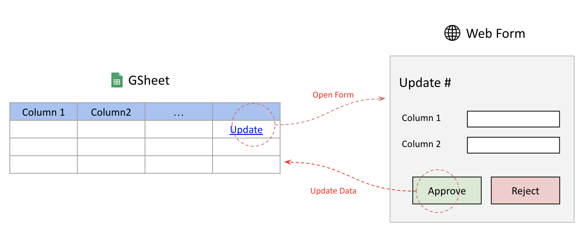

# Golang WebForm for GSheet (WIP)

Example project to provide webform for updating gsheet. Example Gsheet at [here](https://docs.google.com/spreadsheets/d/10FolXVL6ABZ6YMlkLB9JuZWfCVX_MwAXXHJEyQEsr9o/edit?usp=sharing).



## Build

```
make run # run locally
make generate # generate .envrc, mock, etc
```

## Config

`.envrc` will be generated using `make generate`. Make sure you already have [direnv](https://direnv.net/)
```
export APP_ADDRESS=:8089
export APP_READ_TIMEOUT=5s
export APP_WRITE_TIMEOUT=10s
export APP_DEBUG=true
```